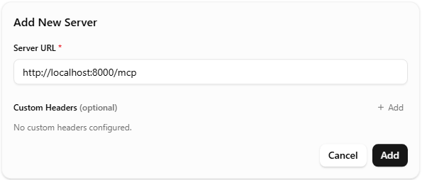
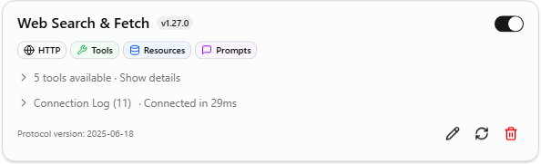

# Web Search & Fetch MCP Server for Local LLMs

An MCP (Model Context Protocol) server that provides web search via [**SearXNG**](https://github.com/searxng/searxng) and high-quality web page fetching via [**Trafilatura**](https://github.com/adbar/trafilatura).

This server uses **SSE (Server-Sent Events)**, making it compatible with `llama.cpp` server and other MCP clients that support SSE transport.

## Architecture



---

## Quick Start

### 1. Build mcp-search-fetch docker image
```bash
docker compose build
```

### 2. Start the services
```bash
docker compose up -d
```
This starts:
- **SearXNG Container**: The search engine (available at http://localhost:8081)
- **MCP Search-Fetch Container**: The bridge between llama.cpp and SearXNG (SSE at http://localhost:8000/mcp), and fetch tool that extract clean text or markdown from any URL using Trafilatura.

### 3. Connect your MCP Client
Add the SSE endpoint to your client configuration (e.g., `llama.cpp server`):

MCP URL: http://localhost:8000/mcp

Add MCP in llama-server Web-UI:


After adding MCP in llama-server Web-UI:


---

## Available Tools

| Tool | Description |
|---|---|
| `web_search` | General web search with language and time-range filters |
| `news_search` | News-category search |
| `advanced_search` | Full control over engines, categories, and pagination |
| `fetch_website_content` | Extract clean text or markdown from any URL |
| `searxng_status` | Check connectivity and engine status |

---

## Additional Configurations

### Customize SearXNG instance

* Edit `searxng/core-config/settings.yml` to configure the SearXNG, such as disabling certain search engines.
* Edit the docker compose files to set environment variables to change the port mappings or other configurations.
** Use `.env.example` to create `.env` file and edit it to your needs.

---

## Testing & Debugging

### CLI Test Script
You can test the search and fetch functionality directly without starting the MCP server:
```bash
# Verify SearXNG is reachable
python mcp-search-fetch/test_search_fetch.py --status

# Quick search
python mcp-search-fetch/test_search_fetch.py "latest news about AI"

# Fetch a website
python mcp-search-fetch/test_search_fetch.py --fetch "https://example.com"
```
## Reproducing Searches
The server logs a `RETRY CURL` command for every search. You can copy-paste this into your terminal to see the raw JSON response from SearXNG for debugging.
